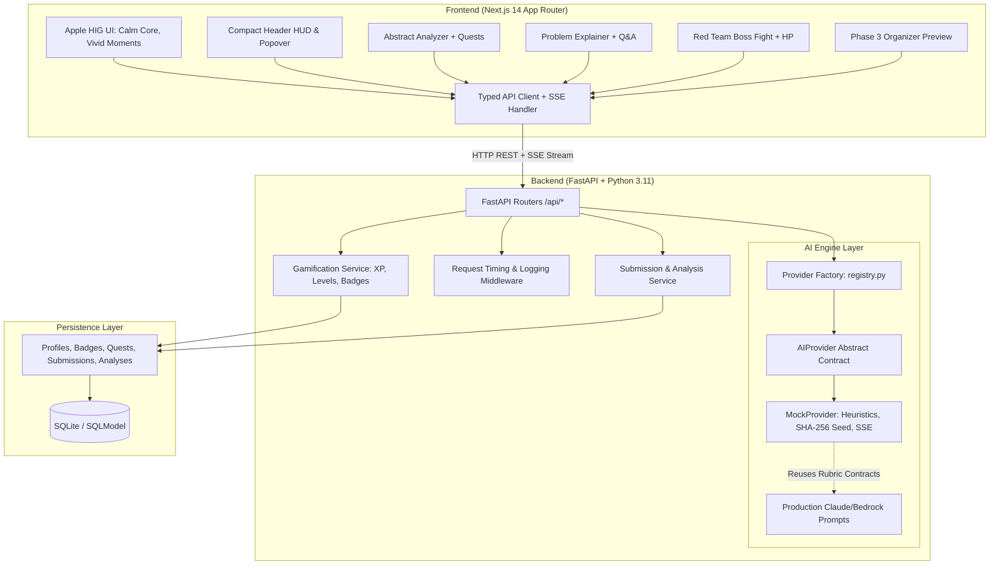
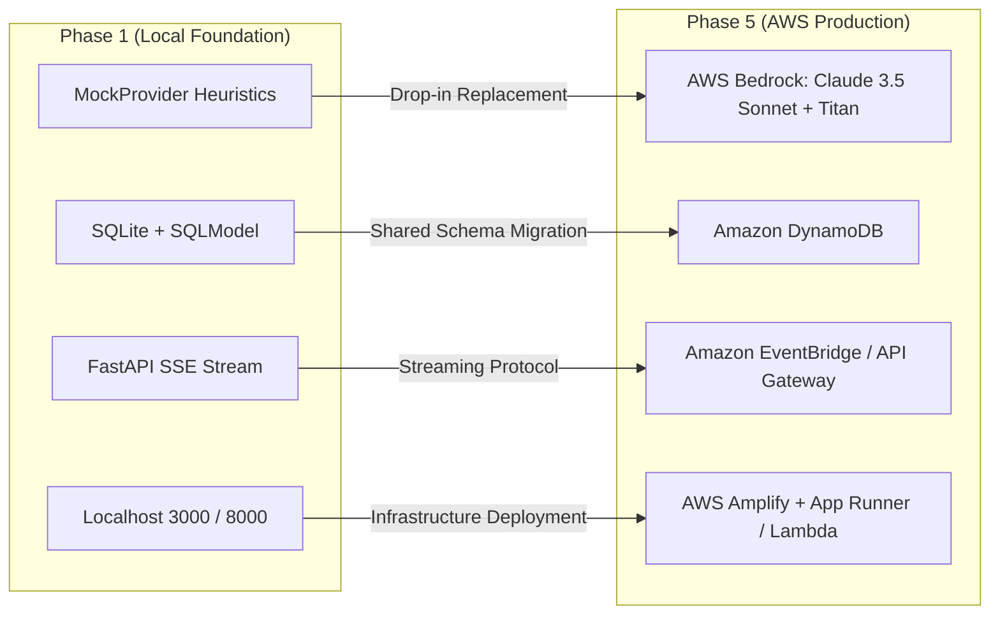

# HackPilot System Architecture & Technical Specifications

> **Phase 1: Foundation + Participant Core**  
> Two-Sided Hackathon Co-Pilot (Participants + Organizers)

---

## 1. System Overview

HackPilot turns hackathon friction into an engaging game. Built with a Next.js 14+ frontend and a FastAPI backend, the platform features a deterministic, input-aware AI engine, three core participant tools (Abstract Analyzer, Problem Explainer, and Idea Red Team), an extensible gamification system, and a shared data layer designed for seamless Phase 3 organizer intelligence.



---

## 2. 6-Phase Evolution & AWS Mapping

HackPilot is deliberately architected so that Phase 1 local services map directly to AWS cloud services in Phase 5:



| Phase 1 Component | Phase 5 AWS Service | Architectural Mapping & Drop-in Contract |
|---|---|---|
| `MockProvider` | **AWS Bedrock** | Replaces `mock_provider.py` with `bedrock_provider.py` calling Claude 3.5 Sonnet using existing `prompts.py` |
| SQLite Tables | **Amazon DynamoDB** | Single-table or entity tables keyed by `user_id` and `submission_id` |
| Local Uploads (Future) | **Amazon S3** | Pre-signed PUT URLs for PDF decks and demo videos (Phase 4) |
| Next.js Frontend | **AWS Amplify** | Serverless Next.js hosting with automated CI/CD |
| FastAPI Backend | **AWS App Runner / Lambda** | Containerized FastAPI deployment behind API Gateway |

---

## 3. AI Engine Abstraction

The AI engine is decoupled behind the `AIProvider` abstract base class in `backend/app/ai/base.py`:

```python
class AIProvider(ABC):
    @abstractmethod
    async def generate_json(
        self,
        feature: str,
        system_prompt: str,
        user_text: str,
        schema: Type[T]
    ) -> T: ...

    @abstractmethod
    async def stream_text(
        self,
        job_id: str,
        feature: str,
        user_text: str
    ) -> AsyncGenerator[str, None]: ...
```

### Deterministic MockProvider Heuristics
- **Input-Aware Hashing**: Computes `hashlib.sha256(user_text)` to seed `random.Random()`. Identical input always yields identical scores and quests; varied inputs yield realistic score spreads.
- **Latency Simulation**: Simulates realistic LLM latency ($300\text{ms} - 800\text{ms}$).
- **Validation Retry**: Pydantic schema validation runs on raw output. On failure, it retries once before returning a standardized error shape: `{"error": {"code": "...", "message": "..."}}`.
- **Textual Heuristics**:
  - Word count and average sentence length.
  - Buzzword density detection (`revolutionary`, `seamless`, `cutting-edge`, `AI-powered`).
  - Key requirement checks (target persona, quantifiable metrics, technical stack, differentiation).
  - Sentence-level keyword overlap for Problem Explainer Q&A, with explicit fallback when unstated.
  - Keyword-tailored Red Team attacks across 7 vulnerability domains with 3 intensity levels (`friendly`, `fair`, `ruthless`).

---

## 4. Gamification Engine & Math

All gamification state is managed in SQLite via `SQLModel`:

1. **Level Curve Formula**:
   $$\text{XP Required for Level } L = \lfloor 100 \times L^{1.5} \rfloor$$
2. **Daily Streak Engine**:
   - Compares `last_active_date` against `date.today()`.
   - $\Delta = 1$ day: increments streak.
   - $\Delta > 1$ day: resets streak to 1.
3. **Badges**:
   - `First Blood`: Completed first analysis or defense.
   - `Bug Hunter`: Completed first weakness quest.
   - `Silver Tongue`: Asked a clarifying question in Problem Explainer.
   - `Ten-Point Jump`: Achieved $\ge +10$ score delta in abstract revision.
   - `3-Day Streak`: Maintained a 3-day active streak.
   - `Unbreakable`: Survived all Red Team attacks with preserved HP.

---

## 5. Frontend: "Calm Core, Vivid Moments"

Engineered according to Apple Human Interface Principles:
- **Simplicity & Restraint**: Neutral base surfaces (`#FBFBFD`/`#FFFFFF` in light, `#08080C`/`#1C1C1E` in dark) with at most **one accent color per tool view** (Blue for Abstract, Amber for Problem, Coral for Red Team, Green for XP, Violet for Organizer).
- **Progressive Disclosure**: Primary results (score dial, verdict, top 3 quests) visible immediately. Deep metrics, cited quotes, all-attacks list, and revision histories are nested behind smooth Framer Motion expanders and sheets.
- **No Third-Party Bloat**: All radial dials, segmented HP bars, sparklines, and SVG cluster visualizations are custom-crafted with native SVG and Framer Motion spring physics.
